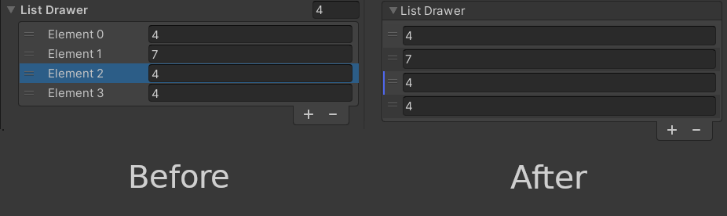

# Editor Plus

## Overview

Editor Plus is a Unity plugin to add functionalities to the the Unity editor.

The goal is to facilitate work with project assets, and improve the overall editor experience. It has some new editor features right out of the box, but also let you write your own, in a more convenient fashion than what Unity does.

## Features

### New editor attributes

Editor Plus comes with some new editor attributes to decorate your fields with:
* **BetterList** lets you customize the way editor lists work, by enabling/disabling the add and remove buttons, along with specifying methods to add or remove elements.
* **Button** must be placed on methods, and will create buttons in the editor to call these functions directly.
* **CustomSpace** lets you add space before *and after* a given element.
* **Disabled** makes the marked element read only in the editor.
* **DisableIf** will make the marked element read only if the member (field, property or method) with the given name returns true.
* **DisableInEditMode** will make the element read only in the inspector if the editor is *not* playing the game.
* **DisableInPlayMode** will make the element read only in the inspector if the editor is playing the game.
* **Dropdown** lets you give a list of values to put in a dropdown in the editor, instead of the regular field editor. You can also give a method name to have the dropdown value change dynamically.
* **HelpBox** puts a help box with the given text above or below the marked field, to give additional information.
* **HideIf** will hide the marked element in the inspector if the member (field, property or method) with the given name returns true.
* **HideInEditMode** will hide the element in the inspector if the editor is *not* playing the game.
* **HideInPlayMode** will hide the element in the inspector if the editor is playing the game.
* **MinMaxSlider** replaces the regular editor with a "double slider", with the given min and max values. This attribute only work on `MinMaxInt` and `MinMaxFloat` typed fields.
* **OnEditorGUI** will mark methods to be called at the end of editor GUI. This allows for display of additional information, along with value checks.
* **Tag** will turn the string field editor into a dropdown to select a game object tag, just like the dropdown one can find at the top of a game object editor.

Attributes descriptions referring to \"elements\" will work on both fields and buttons.

### Improved list editor

Editor Plus improves the list editor, by improving readability. One can also customize the way the list editor work by using the `BetterList` attribute (see above).

### ScriptableObject creation facilitated

Editor Plus adds a right click menu option to scripts assets to directly create a `ScriptableObject`asset based on the target script file. This allows for quick asset creation without using the `CreateAssetMenu` and cluttering the \"Create\" sub-menu.

### Folder targeting made more robust

The plugin adds a new asset type called `FolderLocator`. One can create one and put it inside a folder they want to get the path of, and define its \"folder ID\". Once it is done, inside code, they can call `FolderLocator.GetFolder` with the given ID to get the folder path. This makes working with asset folders resistant to moving/renaming.

### A more easily customizable editor

One can use Editor Plus to add their custom **attribute drawers** or **decorators**. Adding them this way makes it easier, for the drawers and decorators are combined automatically. Moreover, decorators created that way can also be applied to buttons, and can draw both before and after the element.

Once one has implemented these classes, they must use the `PropertyAttributeSetter` to update the `CustomPropertyDrawer` attributes of the Editor Plus drawer class. To prevent any assembly error, one can put all their drawer and decorator classes files in the \"EditorPlus/Editor/CustomDrawers\" folder, and put them in the `EditorPlus.Editor` namespace.

One can also add classes implementing the `IClassDecorator` interface, to add decorators around classes. This is how Buttons and OnEditorGUI attributes work.

For more information about how to implement these, see the in code documentation.

### Some helper functions

Editor Plus provides 2 classes with helper methods: `AssetDatabaseUtils` and `TypeUtils`. The first one provides helper methods to manage assets easily, and the other one methods to get lists of types.

## Compatibility

### Custom Editor

This plugin adds one custom editor to the Unity project. While it should not cause any issue, if it clashes with another editor (like for example the one from another plugin) and you are not happy with the result, you can disable it by defining the `EDITOR_PLUS_DISABLE_EDITOR` scripting symbol. 

If you do so, a couple of functionalities will be taken out:
* The `IClassDecorator` feature will no longer work. That means that the `Button` and `OnInspectorGUI` attributes wont either.
* Lists will not be drawn by Editor Plus anymore, meaning that the `BetterList` attribute will no longer work as well.

### Property Drawers

Editor Plus also adds a `PropertyDrawer` for all its attributes, meaning that it might not work well with some other attributes with their custom property drawers. There is no easy solution to that problem, apart from rewriting their property drawers as Editor Plus' Drawers. 

If one ever try to do so, they might want to add the concerned attribute's namespace to the `PropertyAttributeSetter` blacklist so that if they appear on a field without any Editor Plus attribute, the original property drawer will be called. 

There should not be any problem with `DecoratorDrawer`s, but if there are, a solution would be to rewrite them as `DecoratorDrawer`s just like with property drawers.

## Known issues

The attributes `Tooltip` and `ContextMenuItem`currently do not work with other Editor Plus drawn attributes.